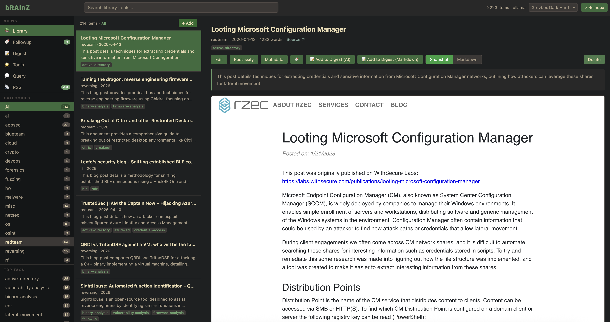
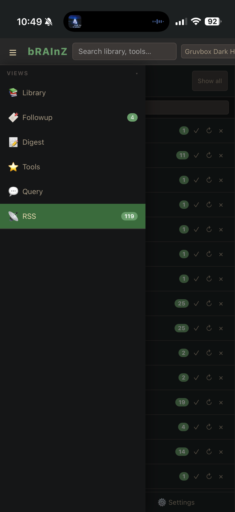
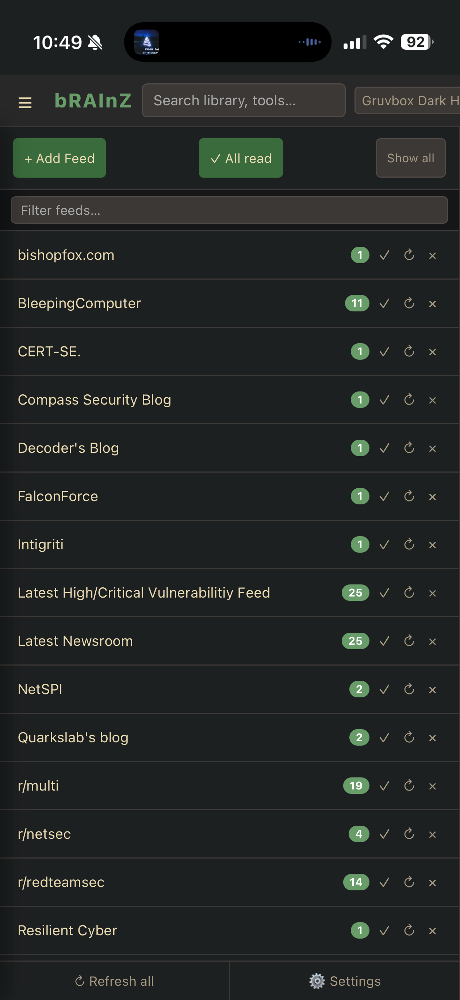

# bRAInZ

> [!CAUTION] 
This project is in early development, do not expose towards hostile environments (internet)!

A private knowledge engine that turns saved articles, PDFs, and notes into a searchable AI corpus.




|iOS WebSite Shortcut:| |
|:-----------|:-------------|
|  |  |
---

## Features

- **Ingest anything** — URLs, PDFs, images (OCR + vision), plain text, browser snapshots
- **Auto-classification** — LLM-assisted categorization and tagging against a configurable taxonomy; k-NN pre-classification on known corrections to avoid redundant LLM calls
- **Semantic search** — vector similarity search across all ingested content
- **RAG query** — ask questions and get answers grounded in your knowledge base with cited sources
- **RSS reader** — subscribe to feeds, read inline, and ingest entries directly into the library
- **GitHub tool tracker** — follow starred repositories from one or more GitHub accounts; ingest repo READMEs into the library
- **Digest** — generate curated reference pages from library items, either LLM-condensed or as raw markdown
- **Plans** — AI-assisted research planning grounded in library content
- **Skills** — generate focused SKILL.md reference sheets from top-matching chunks on a topic
- **MCP server** — expose read-only access to your knowledge base to any MCP-compatible AI agent (Claude Code, Claude Desktop, Cursor)
- **Browser extension** — capture full-page snapshots from Chrome/Edge for offline archiving
- **CLI** — batch import, reindex, reembed, and manage the library from the command line

---

## UI Overview

The single-page app has a collapsible left sidebar with six views:

| View | Description |
|------|-------------|
| **Library** | Main browsing view. Lists all ingested items as cards, filterable by category and tag from the sidebar. Click any item to open a detail panel showing the full content, metadata, snapshot, and actions (edit tags, delete, followup, generate digest/skill/plan). |
| **Followup** | Reading list. Items tagged `followup` appear here for focused review. Add items via the bookmark button in any detail panel. The sidebar badge shows the current count. |
| **Digest** | Generated reference pages. Create condensed or raw-markdown digests from one or more library items; browse and read saved pages. |
| **Tools** | GitHub tool tracker. Follow starred repositories from one or more GitHub accounts; browse by topic, view READMEs, and ingest repos directly into the library. |
| **Query** | RAG-powered Q&A. Ask a natural-language question; the system retrieves relevant chunks, sends them as context to the configured LLM, and returns a grounded answer with cited sources. |
| **RSS** | Feed reader. Subscribe to RSS/Atom feeds, read entries inline, and ingest any entry into the library with one click. The sidebar badge shows unread count. |

---

## Architecture

```
Browser (single-page app, vanilla JS)
        |
        | REST/JSON  (X-API-Key)
        v
FastAPI backend  (Python 3.12, single worker, port 8000)
        |
        v
pipeline.py  ->  ingestion  ->  classifier  ->  storage  ->  RAG
        |
        v
/data/  (filesystem — no database)
```

Everything is stored as files. The library lives in `data/library/`, embeddings in `data/embeddings/`, and an in-memory index is rebuilt from the filesystem on startup. There is no database to run or migrate.

---

## Requirements

- Docker and Docker Compose
- An LLM backend: [Ollama](https://ollama.com) (local), Anthropic API, OpenAI API, or any OpenAI-compatible endpoint

---

## Getting Started

**1. Copy the environment file and set your API key.**

```bash
cp .env.example .env
```

Edit `.env`:

```env
API_KEYS=your-generated-key-here

# Only needed if using Anthropic or OpenAI providers:
# ANTHROPIC_API_KEY=sk-ant-...
# OPENAI_API_KEY=sk-...
```

Generate a key with `uuidgen` or any random string generator. Leave `API_KEYS` empty to run in dev mode with no authentication.

**2. Configure the LLM provider.**

Copy the default config and edit it:

```bash
mkdir -p data
cp data/config.yaml.example data/config.yaml  # or create from the sample below
```

The default provider is `ollama`. Set `llm.provider` in `data/config.yaml`:

```yaml
llm:
  provider: ollama   # or: anthropic, openai, openai_compatible
  ollama:
    base_url: http://host.docker.internal:11434
    query_model: gemma4:26b
    classification_model: gemma3:12b
    embedding_model: mxbai-embed-large:latest
    embedding_dimensions: 1024
```

For Ollama, pull the models you intend to use before starting:

```bash
ollama pull mxbai-embed-large
ollama pull gemma3:12b
```

**3. Start the application.**

```bash
docker compose up
```

Open `http://localhost:8000` in your browser.

---

## Configuration

All runtime configuration lives in `data/config.yaml`. The file is read on startup; most settings take effect after a container restart.

### LLM Providers

| Provider | Classification | Query | Embedding |
|----------|---------------|-------|-----------|
| `ollama` | configurable | configurable | configurable |
| `anthropic` | claude-haiku-4-5-20251001 | claude-sonnet-4-6 | voyage-3 (1024d) |
| `openai` | gpt-4o-mini | gpt-4o | text-embedding-3-small (1536d) |
| `openai_compatible` | configurable | configurable | configurable |

Classification and query use separate models — use a fast, cheap model for classification and a stronger one for query.

### Thinking models (Ollama)

For models that support reasoning (gemma4, qwen3, etc.), enable thinking for RAG queries:

```yaml
llm:
  ollama:
    query_think: true
```

When enabled, the query view shows a collapsible "Reasoning" section above the answer.

### Taxonomy

Categories and per-category tag allowlists are defined in `data/taxonomy.yaml`. The file is watched for changes and reloaded automatically without a restart.

---

## Data Layout

```
data/
  config.yaml              LLM provider, ingestion, and RAG settings
  taxonomy.yaml            Categories and tag allowlists
  corrections.yaml         Manual k-NN classification corrections
  index.json               In-memory item index (rebuilt on startup)
  library/
    {category}/
      {year_slug}/
        metadata.yaml
        content.md         Full markdown with images (for display)
        content_llm.md     Image-stripped variant (for embedding)
        snapshot.html      Self-contained HTML archive (URL items)
        chunks.json        Paragraph chunks
        assets/            Extracted base64 blobs > 75KB
  embeddings/
    {item_id}.npz          Per-item vectors
    index.npz              Combined vector matrix
    chunk_map.json         Matrix row to item/chunk mapping
  digest/                  Generated digest pages
  skills/                  Generated SKILL.md files
  rssfeeds/                Feed metadata and entry cache
  tools/                   GitHub repository cache and READMEs
```

The data directory is a Docker volume mount (`./data:/data`). Back it up like any other directory.

---

## Browser Extension

A Chrome/Edge extension is included in `frontend/extension/`. It captures full-page snapshots and sends them to your bRAInZ instance.

To install:
1. Open `chrome://extensions` (or `edge://extensions`)
2. Enable Developer mode
3. Click "Load unpacked" and select the `frontend/extension/` directory
4. Open the extension options and set your bRAInZ URL and API key

---

## MCP Server

The `mcp/` directory contains a read-only MCP server that exposes your knowledge base to MCP-compatible AI agents.

```bash
cd mcp
python3 -m venv .venv
.venv/bin/pip install mcp httpx
```

See [docs/mcp.md](docs/mcp.md) for Claude Code, Claude Desktop, and Cursor integration instructions.

---

## CLI

Common operations are available from the command line inside the container:

```bash
docker compose exec brainz python cli/main.py --help
```

See [docs/cli.md](docs/cli.md) for the full reference.

---

## Documentation

| Document | Description |
|----------|-------------|
| [docs/mcp.md](docs/mcp.md) | MCP server setup and tool reference |
| [docs/cli.md](docs/cli.md) | CLI command reference |
| [docs/Classification.md](docs/Classification.md) | How classification and taxonomy work |
| [docs/api-reference.md](docs/api-reference.md) | REST API reference |
| [docs/iphone-shortcut-setup.md](docs/iphone-shortcut-setup.md) | iOS Shortcuts integration |
| [SYSTEM.md](SYSTEM.md) | Internal architecture reference |
